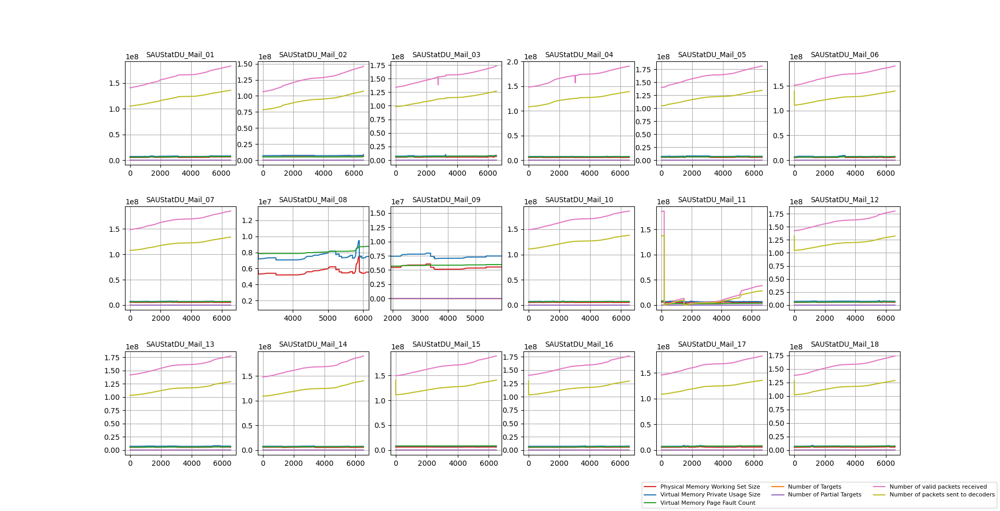
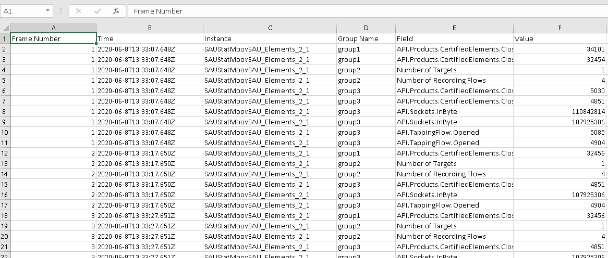

Statistics analyzer tool
========================

Tool for parsing SAU logs from their specific format, and display thier statistics in `matplot` graph. 


How to build or contribute to project:
- Python 3 intepreter
- `pip install progress`
- `pip install matplot`
- requires `json` module
- requires `csv` module

Create a single exe:
- Use `pyinstaller App.py --onefile`


Usage: [TODO]
- see example how to generate a parser from `db_ver1.json`
- Run `App.exe` as a standalone in command line: `App.exe myjson.json` if no argument provided, app will use `db_ver1.json` assuming it's in the same dir.
- When `matplot` shows graphs, you can use the submenu, too slide forward or zoom specific parts of graphs.  
- [TODO] Plotter will use new plot data. Do not use for now.

DSL from `json` file
====================
```
{
	"main-separator" : "PacketRouter Statistics:",
	"opt-separator": "====",
	"main-delimiter" : ":",
	"short-export" : false, 	
	"ui-mode" : false, 
	"path" : "C:\\Users\\izapryanov.VERINT\\Desktop\\Samba\\Moov\\215.1.17.31",
		"group1": {			
			"name" : "Camera360Elements Statistics:",
			"fields" : ["API.Products.CertifiedElements.Closed"] 
		},
		"group2" : {
			"mandatory" : false,
			"name" : "Provisioning statistics:",
			"fields" : ["Number of Recording Flows", "Number of Targets"]
		},
		"group3" : {
			"name" : "DailyhuntElements Statistics:",
			"fields" : ["API.Products.CertifiedElements.Closed", "API.Sockets.InByte", "API.TappingFlow.Opened"]
		}
}
```

- `main-separator` - `string` if not set to anything `PacketRouter Statistics:` will be set by default for frame cut.
- `opt-separator` - `string` if not set to anything `====` will be used to `strstr()` at least `=` counts to cut off duplicated sub-frames
- `main-delimiter` : `char` or `string` if not set `:` will be used to split desired lines.
- `ui-mode` - `true` or `false` enable \ disable plotter or CSV exporter. 
- `short-export` - `true` or `false` it will export a minimal report for only one entry per `PacketRouter Statistics:` frame
- `path` - folder to SAU logs (up to 18)
- `group` - parser to be generated dynamically. 
- `name` - Group of statistics to be matched in SAU (like `Packet router statistics`)
- `fields` - sub fields from specific group to match (ex. `NUmber of valid packets...`)
- `mandatory` - `true` or `false` it will mark a specific group items to be mandatory or not [TODO]
`TimeParser.py` - used to parse time of SAU and sort log by time, since file is cyclic and older entries might appear earlier in the log file.


Limitations:
============
~~- Parsing does not support duplicated fields per `Packet Router Statistics` context. Ex. Plugins won't be resolved.~~ 
- `ui-mode` does not support more than 18 subplots, adding more will break the UI layouts and hampers visualisations.

Run:
====
Download form Bin\Win32 `App.exe` and `db_ver1.json` and double clikc on it to verify all is working.

Example view:
==



csv file example output:
========================



Notes:
- Please ignore `App.exe` warning ` MATPLOTLIBDATA environment variable was deprecated in Matplotlib 3.1 and will be removed in 3.3.` it's python's stuff not relevant to the application. 

[TODO: @oksana: add more to readme]
